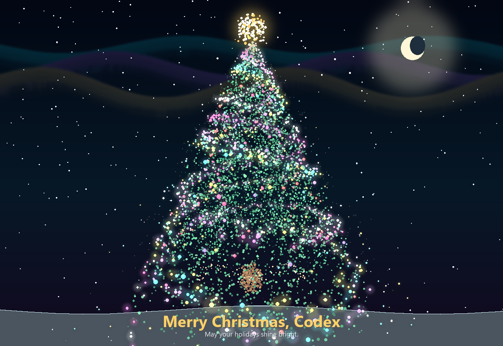

# Aurora Christmas Tree

A polished desktop Christmas tree rendered from thousands of tiny animated particles. Built with Python, Tkinter, and Pillow.



## Highlights

- Dense particle tree with thousands of independently animated points.
- Subtle 3D projection, slow rotation, breathing motion, wind sway, twinkling lights, snow, aurora glow, and a luminous star.
- GUI controls for pause/resume, replay, theme switching, PNG export, and particle density.
- Mouse drag interaction for rotating the tree.
- Headless preview generation for screenshots, README assets, and CI.
- Lightweight dependency footprint: Pillow plus Python's built-in Tkinter.

## Tech Stack

| Area | Technology | Role |
| --- | --- | --- |
| Language | Python 3.10+ | Application code and CLI entry point |
| Desktop GUI | Tkinter | Window, toolbar, dialogs, mouse and keyboard input |
| Rendering | Pillow | Particle drawing, gradients, glow, snow, PNG export |
| CI | GitHub Actions | Compile check and preview generation |
| Packaging | `pyproject.toml` | Project metadata and optional script entry point |

## Installation

Clone the repository and install the runtime dependency:

```bash
git clone https://github.com/<your-username>/merry-christmas.git
cd merry-christmas
python -m venv .venv
```

Activate the virtual environment:

```bash
# Windows PowerShell
.\.venv\Scripts\Activate.ps1

# macOS / Linux
source .venv/bin/activate
```

Install dependencies:

```bash
python -m pip install --upgrade pip
python -m pip install -r requirements.txt
```

## Usage

Start the GUI:

```bash
python tree_gui.py
```

Run without the name dialog:

```bash
python tree_gui.py --name "Ada" --no-dialog
```

Choose a theme and density:

```bash
python tree_gui.py --theme frost --density 1.25
```

Generate a static preview image:

```bash
python tree_gui.py --preview assets/preview.png --name "Ada" --width 1280 --height 880 --density 1.2
```

## Controls

| Control | Action |
| --- | --- |
| `Space` | Pause or resume animation |
| `R` | Replay with a new particle seed |
| `S` | Save the current frame as PNG |
| Mouse drag | Rotate the particle tree |
| Toolbar | Pause, replay, export, switch theme, adjust density |

## Themes

The app ships with three built-in visual themes:

- `aurora`
- `ruby`
- `frost`

Example:

```bash
python tree_gui.py --theme ruby --density 1.3
```

## Project Structure

```text
.
|-- assets/
|   `-- preview.png
|-- .github/
|   `-- workflows/
|       `-- ci.yml
|-- tree_gui.py
|-- requirements.txt
|-- pyproject.toml
|-- LICENSE
`-- README.md
```

## Quality Checks

Run the same checks used by CI:

```bash
python -m compileall tree_gui.py
python tree_gui.py --preview assets/preview.png --name "CI" --width 1000 --height 700 --density 1.1
```

## License

MIT License.
